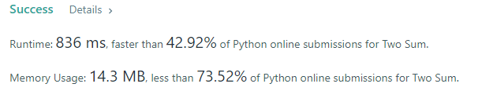
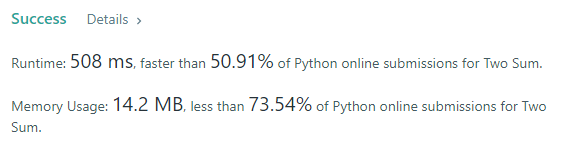
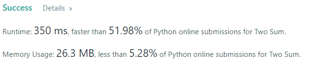

# Problem Description : 

Given an array of integers nums and an integer target, return indices of the two numbers such that they add up to target.

You may assume that each input would have exactly one solution, and you may not use the same element twice.

You can return the answer in any order.

#### Example 
```shell
Input: nums = [2,7,11,15], target = 9
Output: [0,1]
Output: Because nums[0] + nums[1] == 9, we return [0, 1].
```

#### Constraints 

- 2 <= nums.length <= 104
- -109 <= nums[i] <= 109
- -109 <= target <= 109
- Only one valid answer exists.

#### Complexity 
The complexity of the solution should be less than O(n2).

#### Read more
https://leetcode.com/problems/two-sum
<hr>

# Solution 

## Important
In this problem, we assume that only one valid answer exists for each input target in the test. It means that the solution will return the first answer found. However, my solutions give in output all the possible valid answer for each input target. As a result, this will affect the runtime and the memory usage.

## My Solution 1 : 

File name : ```Leetcode_Problem1_Two_Sum_Solution1.py```. 

####  1.1 Solution for many valid answers
**I assumed that we have many valid answers for each input target.** ```Leetcode_Problem1_Two_Sum_Solution1.py```
#### Results 


####  1.2 Solution for only one valid answers
**I assumed that we have many valid answers for each input target. ** 
#### Results 



## My Solution 2 : 

File name : ```Leetcode_Problem1_Two_Sum_Solution2.py```

#### Results 


